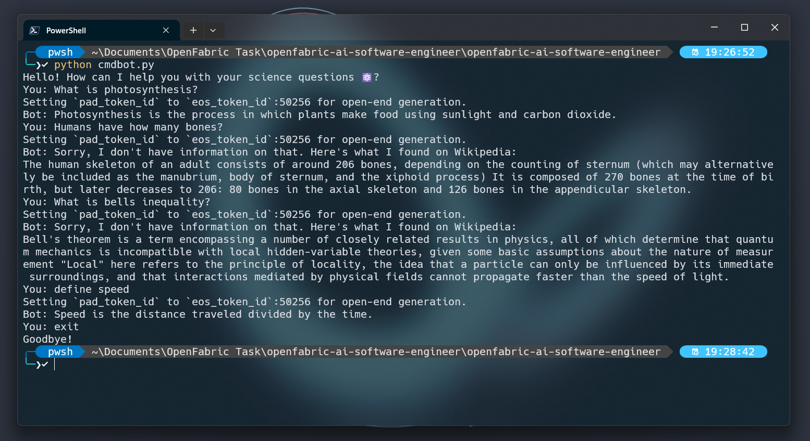
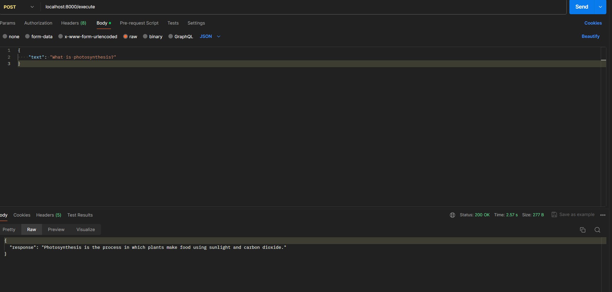
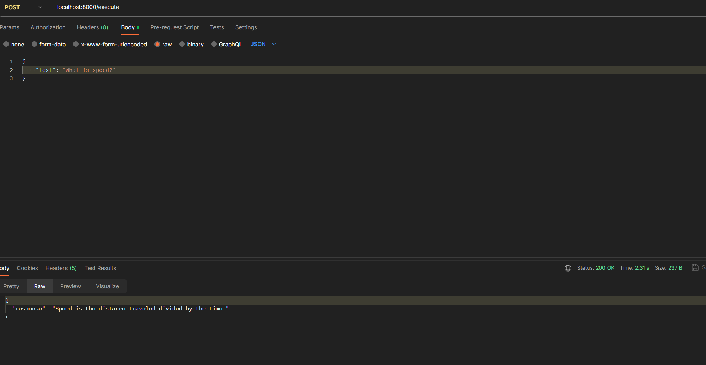
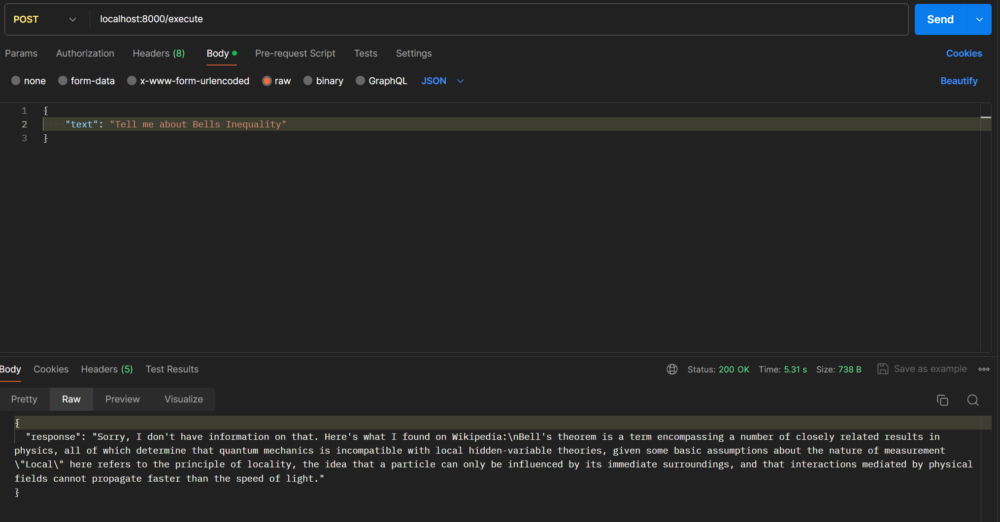

# NLP Bot for Science Queries

### Introduction

The task involved creating an NLP bot specialized in handling science-related queries. The objective was to leverage pre-trained models and fine-tune them for the specific science domain. The process involved preparing a dataset, finetuning a GPT-2 transformer, and implementing the main logic for the bot.

### Steps Taken

#### 1. Dataset Preparation

I used SciQ dataset for training the model. The dataset included questions, distractors, correct answers, and supporting information. The following steps were taken for dataset preparation:

- Conversion from JSON to TXT format.
- Removal of distractors, retaining only questions and answers.

link to dataset: https://allenai.org/data/sciq

#### 2. Model Finetuning

The GPT-2 transformer was chosen for its efficiency, considering available computing resources. The model was finetuned using the prepared dataset for 15 epochs. The relevant code snippet is provided below:

```python
from transformers import GPT2LMHeadModel, GPT2Tokenizer, TextDataset, DataCollatorForLanguageModeling, Trainer, TrainingArguments

# Load preprocessed dataset
with open(datapath, 'r', encoding="utf-8") as file:
    preprocessed_data = file.readlines()

# Initialize GPT-2 tokenizer and model
tokenizer = GPT2Tokenizer.from_pretrained('gpt2')
model = GPT2LMHeadModel.from_pretrained('gpt2')

# Tokenize the dataset
tokenized_dataset = TextDataset(
    tokenizer=tokenizer,
    file_path=datapath,
    block_size=128
)

# Configure training arguments
training_args = TrainingArguments(
    output_dir='./gpt2-finetuned-science',
    overwrite_output_dir=True,
    num_train_epochs=15,
    per_device_train_batch_size=6,
    save_steps=10_000,
    save_total_limit=2,
)

# Configure data collator
data_collator = DataCollatorForLanguageModeling(
    tokenizer=tokenizer,
    mlm=False
)

# Initialize Trainer
trainer = Trainer(
    model=model,
    args=training_args,
    data_collator=data_collator,
    train_dataset=tokenized_dataset,
)

# Fine-tune the model
trainer.train(resume_from_checkpoint=True)

# Save the fine-tuned model
model.save_pretrained('./gpt2-finetuned-science')
tokenizer.save_pretrained('./gpt2-finetuned-science')
trainer.save_model()
```

#### 3. Main Logic Implementation

The main logic for the NLP bot was implemented in Python. It involved using the spaCy library for natural language processing and extracting nouns from user queries. Additionally, the bot utilized the Wikipedia library to retrieve summaries for complex topics. The core logic is encapsulated in the `BotLogic` class. Here is a code snippet:

```python
# bot_logic.py
import spacy
from transformers import GPT2LMHeadModel, GPT2Tokenizer
import wikipedia

class BotLogic:
    def __init__(self, model_path='./gpt2-finetuned-science'):
        # Initialization of the GPT-2 model, tokenizer, and spaCy NLP pipeline

    def extract_keywords(self, question):
        # Extraction of keywords (nouns) from the user's question using spaCy

    def generate_response(self, prompt, max_length=80):
        # Generation of a response using the finetuned GPT-2 model and Wikipedia library
```

### Running the Bot

To use the NLP bot, you can instantiate the `BotLogic` class and call the `generate_response` method with a user query. Here's an example:

```python
#app.py
from flask import Flask, request, jsonify
from bot_logic import BotLogic

app = Flask(__name__)
bot_logic = BotLogic()

@app.route('/execute', methods=['POST'])
def execute():
    try:
        # Get the JSON data from the request
        data = request.get_json()

        # Ensure the 'text' key is present in the request
        if 'text' not in data:
            return jsonify({'error': 'Missing "text" parameter'}), 400

        # Get the text from the 'text' parameter
        input_text = data['text']

        # Process the input using BotLogic
        response = bot_logic.generate_response(input_text)

        # Return the response in JSON format
        return jsonify({'response': response})

    except Exception as e:
        return jsonify({'error': str(e)}), 500

if __name__ == '__main__':
    # Run the Flask application
    app.run(debug=True, host='0.0.0.0', port=8000)

```

This example demonstrates how to interact with the bot and receive a response based on the user's science-related query.



### **Sending api request via PostMan:**


